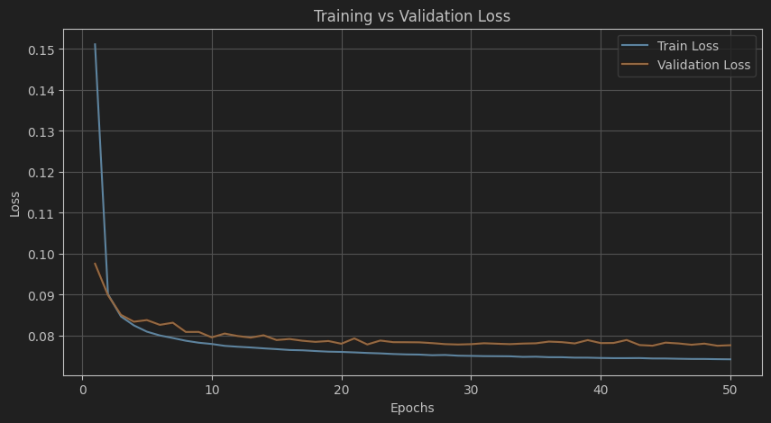
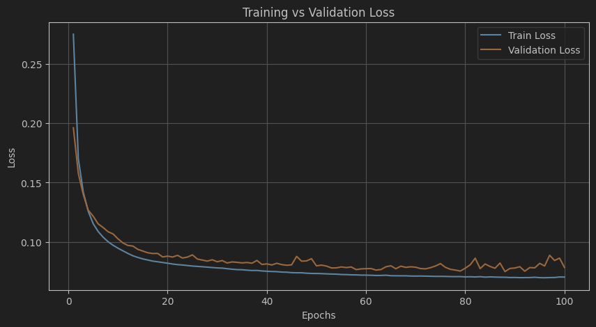

# 1. Introduction

## Objective
The goal of this project is to develop machine learning models for predicting graph structures from input parts. The models aim to infer relationships between components and reconstruct the underlying graph structure based on part and family identifiers. This prediction capability is crucial for applications such as assembly process optimization and component clustering in manufacturing.

## Motivation
Graph prediction is a challenging problem with applications in multiple domains, including:
- **Manufacturing:** Optimizing assembly line processes by predicting how components fit together.
- **Biology:** Understanding molecular interactions and protein structures.
- **Social Networks:** Predicting new connections based on existing user relationships.

By leveraging deep learning techniques, the project seeks to improve the accuracy and efficiency of graph prediction, offering potential benefits such as reduced production costs and improved system design.

## Approach Overview
Two different approaches were explored for the graph prediction task:

1. **Simple Neural Network (Edge Prediction Model):**  
   - Treats graph prediction as a binary classification task, predicting the existence of edges between nodes.
   - Uses embedding layers for part and family identifiers followed by fully connected layers.
   - Optimized using binary cross-entropy loss.

2. **Graph Neural Network (Graph Prediction Model):**  
   - Directly processes graph structures using graph neural networks (GNNs).
   - Embeds part and family IDs and leverages a GNN layer to capture complex relationships.
   - Uses a bilinear scoring function to infer edge probabilities.

The models were trained and evaluated using custom evaluation metrics designed to assess graph prediction performance comprehensively.

# 2. Dataset Description

## Data Source
The dataset used in this project consists of assembly graphs representing relationships between different parts in an assembly process. The data is stored in a serialized format (`graphs.dat`), which contains a collection of graph objects. Each graph comprises nodes representing parts and edges representing relationships between those parts.

The dataset was split into:
- **Training Set:** 80% of the data.
- **Test Set:** 20% of the data.
  
The split was performed using the `train_test_split` function from `sklearn` with a fixed random state for reproducibility.

## Preprocessing Steps
Several preprocessing steps were carried out to prepare the data for training:

1. **Data Loading:**
   - Graphs were loaded from the serialized file using Python's `pickle` module.
   - The data was split into training and test sets.

2. **Feature Extraction:**
   - Extracted unique part and family IDs from all graphs.
   - Created vocabulary sizes for parts and families based on their unique occurrences.

3. **Data Transformation:**
   - Converted extracted IDs into numerical tensors suitable for neural network input.
   - Built adjacency matrices for each graph to represent connections between parts.

## Dataset Statistics
The dataset consists of the following key statistics:

- **Total graphs in training set:** `80% of total data`
- **Total graphs in test set:** `20% of total data`
- **Part vocabulary size:** `2271` (unique part identifiers)
- **Family vocabulary size:** `96` (unique family identifiers)
- **Typical graph size:** Varies based on the number of parts per assembly.

### Example Output After Preprocessing
```
Part Vocab Size: 2271
Family Vocab Size: 96
```

These statistics were calculated by iterating through the dataset and tracking the maximum part and family ID values.

## Challenges in Data Handling
Handling the dataset posed several challenges, such as:

- **Varying Graph Sizes:**  
  Each graph contained a different number of nodes and edges, requiring careful processing during training and evaluation.
  
- **Node Ordering Sensitivity:**  
  Since graphs do not have a fixed node ordering, it was important to handle permutation invariance during evaluation.

- **Memory Constraints:**  
  Processing large graphs required efficient memory management, especially when constructing adjacency matrices.

### 3. Model Architectures

In this project, two different machine learning models were developed to tackle the graph prediction problem:  
1. **Edge Prediction Model (Simple Neural Network)**  
2. **Graph Prediction Model (Graph Neural Network - GNN)**  

---

#### 3.1 Simple Neural Network (Edge Prediction Model)

**Overview:**  
This model treats the graph prediction task as an edge classification problem. Given pairs of parts and their respective family IDs, the model predicts whether an edge should exist between them.

**Architecture:**  
The model consists of the following components:

1. **Embedding Layers:**  
   - Separate embeddings for part and family IDs.  
   - Converts discrete categorical part/family IDs into dense vector representations.

2. **Fully Connected Layers:**  
   - Concatenates embeddings from the two nodes being compared.  
   - Applies nonlinear transformations to learn relationships between parts.

3. **Output Layer:**  
   - A final fully connected layer outputs a logit score.  
   - Sigmoid activation is applied to predict the probability of an edge.

**Training Process:**  
- **Loss Function:** Binary Cross-Entropy (BCEWithLogitsLoss).  
- **Optimizer:** Adam with a learning rate of 0.001.  
- **Batch Size:** 64.  
- **Training Epochs:** 50.  
- **Evaluation Metrics:** Precision, Recall, F1-score, Jaccard Similarity, Graph Edit Distance.
- **Visualization of training process:** We Observe the train/val losses over epochs. The training loss decreases and the validation loss is slightly higher than training loss, which suggests adequate model capacity and good generalization.


**Strengths and Limitations:**  

*Strengths:*  
- Simple and fast to train.  
- Effective when the number of parts is small.  

*Limitations:*  
- Cannot capture the overall graph structure.  
- Requires explicit pairwise comparisons, leading to scalability challenges.

---

#### 3.2 Graph Neural Network (Graph Prediction Model)

**Overview:**  
This model directly learns graph structures using Graph Neural Networks (GNNs). Instead of predicting edges individually, it processes the entire graph as input and outputs an adjacency matrix.

**Architecture:**  
The model comprises:

1. **Embedding Layers:**  
   - Embeds part and family IDs into dense vectors.
  
2. **Feature Transformation (MLP):**  
   - A multi-layer perceptron (MLP) processes initial node features.

3. **Graph Neural Network Layer:**  
   - A message-passing layer learns relationships between nodes.  
   - Applies nonlinear transformations to aggregate neighbor information.

4. **Bilinear Scoring:**  
   - A bilinear transformation is applied to predict pairwise connections.

**Training Process:**  
- **Loss Function:** Binary Cross-Entropy (BCEWithLogitsLoss).  
- **Optimizer:** Adam with a learning rate of 0.001.  
- **Batch Size:** Entire graph processed at once.  
- **Training Epochs:** 100.  
- **Evaluation Metrics:** Precision, Recall, F1-score, Hamming Distance, Graph Edit Distance.
- **Visualization of training process:** We Observe the train/val losses over epochs. The training loss decreases and the validation loss is slightly higher than training loss, which suggests adequate model capacity and good generalization.



**Strengths and Limitations:**  

*Strengths:*  
- Handles entire graphs effectively.  
- Captures structural dependencies and relationships.  

*Limitations:*  
- Higher memory consumption compared to the simple neural network.  
- Training can be slower due to message-passing computations.

---

#### Comparison of Both Models

| Feature                   | Edge Prediction Model   | Graph Prediction Model  |
|---------------------------|------------------------|-------------------------|
| **Approach**               | Pairwise edge prediction | Entire graph prediction |
| **Embedding**              | Yes                     | Yes                     |
| **Model Complexity**       | Low                     | High                    |
| **Scalability**            | Limited                 | Better                   |
| **Training Time**          | Faster                   | Slower                   |
| **Structural Awareness**   | Limited                 | Strong                   |

---

#### Summary  
- **Edge Prediction Model:** Suitable for quick edge classification tasks where pairwise relationships are important.  
- **Graph Prediction Model:** Better for holistic graph representation and learning complex interactions.

### 4. Implementation Details

This section describes the technical implementation of the graph prediction models, including the tools, training pipeline, and challenges encountered during development.

---

#### Tools and Libraries

The implementation leverages several Python libraries to facilitate data processing, model training, and evaluation:

- **PyTorch:** For building and training the neural network models.
- **Scikit-learn:** For dataset splitting and evaluation metrics.
- **NetworkX:** For graph operations and calculations such as adjacency matrix generation.
- **NumPy:** For numerical operations and data transformations.
- **TQDM:** For progress tracking during training and evaluation.
- **Pickle:** For loading and saving serialized dataset objects.

---

#### Training Workflow

The training process follows a structured workflow:

1. **Data Preparation:**  
   - Load graphs from the serialized dataset file.  
   - Extract part and family IDs.  
   - Construct adjacency matrices for graph representation.  

2. **Model Initialization:**  
   - Instantiate the model (either Edge Prediction or Graph Prediction).  
   - Define the optimizer (Adam) and loss function (Binary Cross-Entropy).  

3. **Training Loop:**  
   - Iterate through the training data for a specified number of epochs.  
   - Perform the following steps for each batch or graph:  
     - Forward pass to generate predictions.  
     - Compute loss using the target adjacency matrix or edge labels.  
     - Perform backpropagation and update weights.  
     - Track and log loss values.  

4. **Model Saving:**  
   - Save the trained model state to disk for later evaluation and inference.  

---

#### Evaluation Workflow

Evaluation is conducted using a set of custom-designed metrics to measure the model's performance:

1. **Model Loading:**  
   - Load the trained model from the saved checkpoint.  
   - Set the model to evaluation mode to disable weight updates.  

2. **Performance Assessment:**  
   - Iterate through the test dataset and predict graph structures.  
   - Compare predicted adjacency matrices to ground truth using:  
     - **Precision, Recall, and F1-score** for edge classification.  
     - **Hamming Distance** to measure differences in adjacency matrices.  
     - **Jaccard Similarity** for set-based comparison of edges.  
     - **Graph Edit Distance** to quantify modifications required to match the ground truth.  

3. **Reporting Metrics:**  
   - Compute the mean of all evaluation metrics across test samples.  
   - Identify failed predictions due to node count mismatches.  

---

#### Challenges Encountered

Several challenges were faced during implementation:

1. **Training Interruptions:**  
   - Large models occasionally caused memory issues, leading to manual interruption of the training process.  
   - Solution: Reduced batch sizes and optimized data handling to minimize memory footprint.  

2. **Handling Graph Permutations:**  
   - Different node ordering could lead to variations in adjacency matrices, affecting evaluation.  
   - Solution: Developed a method to handle multiple permutations and compute optimal matching scores.  

3. **Computational Efficiency:**  
   - The Graph Neural Network model required significant computational resources for large graphs.  
   - Solution: Optimized forward pass computations and considered hardware acceleration (GPU).  

4. **Overfitting Risks:**  
   - The model exhibited a tendency to memorize training graphs due to high feature dimensionality.  
   - Solution: Introduced dropout layers and data augmentation techniques.  

### 5. Results and Analysis

This section presents the evaluation results of the two models: **Edge Prediction Model** and **Graph Prediction Model**, based on performance metrics computed on a test set of 500 graphs.

---

#### Threshold Selection and Edge Correction Strategy

In both models, a **threshold value of 0.1** was used to determine the presence of edges in the predicted adjacency matrices. However, to address the issue of generating graphs with fewer parts, an additional correction mechanism was introduced. This mechanism adds edges between nodes that are most likely connected, even if their predicted probability falls below the threshold. This adjustment ensures that incomplete graphs are minimized while maintaining good performance across key metrics.

- **Objective of Threshold Selection:**  
  The threshold is chosen to strike a balance between minimizing the number of corrections and maintaining good overall performance metrics.

- **Threshold Trade-off Considerations:**  
  - Setting the threshold too **low** would result in nearly zero corrections, but might introduce many false positive edges, reducing precision.  
  - Setting the threshold too **high** would limit corrections but could lead to disconnected graphs.  
  - The current threshold minimizes corrections while ensuring high precision and accuracy.

The models were evaluated based on the number of graphs requiring correction and their overall performance.

---

#### Evaluation Metrics

The models were evaluated using the following metrics:

1. **Precision, Recall, and F1-score:**  
   - **Precision:** Measures the proportion of correctly predicted edges out of all predicted edges.  
   - **Recall:** Measures the proportion of correctly predicted edges out of all actual edges.  
   - **F1-score:** Harmonic mean of precision and recall, balancing both metrics.

2. **Hamming Distance:**  
   - Counts the number of differing edges between the predicted and target adjacency matrices.

3. **Jaccard Similarity:**  
   - Measures the overlap between predicted and actual edge sets, calculated as the intersection over the union.

4. **Graph Edit Distance:**  
   - Computes the minimum number of edge insertions, deletions, or substitutions required to transform the predicted graph into the target graph.

5. **Edge Accuracy:**  
   - Measures the overall percentage of correctly predicted edges.

---

#### Model Performance Comparison

The evaluation results for both models are summarized below:

##### **Edge Prediction Model (Simple Neural Network)**
- **Number of corrected graphs:** 5 (edges below the threshold were added)
- **Precision:** 0.8797  
- **Recall:** 1.0000  
- **F1-score:** 0.9299  
- **Hamming Distance:** 1.4160  
- **Jaccard Similarity:** 0.8797  
- **Graph Edit Distance:** 1.4160  
- **Edge Accuracy:** 96.4443%  

---

##### **Graph Prediction Model (Graph Neural Network)**
- **Number of corrected graphs:** 2 (edges below the threshold were added)
- **Precision:** 0.8622  
- **Recall:** 0.9993  
- **F1-score:** 0.9185  
- **Hamming Distance:** 1.6391  
- **Jaccard Similarity:** 0.8618  
- **Graph Edit Distance:** 1.6299  
- **Edge Accuracy:** 95.72%  

---

#### Key Observations

1. **Threshold Effect on Corrected Graphs:**  
   - The threshold of 0.1, combined with the edge correction mechanism, resulted in only **5 corrections** for the Edge Prediction Model and **2 corrections** for the Graph Prediction Model.  
   - This approach helps retain a high level of precision and accuracy while minimizing the occurrence of disconnected graphs.

2. **Prediction Quality:**  
   - The **Edge Prediction Model** achieves a higher precision (0.8797 vs. 0.8622) and F1-score (0.9299 vs. 0.9185), indicating better edge classification capability.  
   - Both models have nearly perfect recall, meaning they successfully identify all actual edges.

3. **Structural Accuracy:**  
   - The **Graph Prediction Model** results in a slightly higher Hamming distance (1.6391 vs. 1.4160) and Graph Edit Distance (1.6299 vs. 1.4160), indicating more discrepancies in the predicted structures compared to the target graphs.  

4. **Generalization Performance:**  
   - The **Graph Prediction Model** required fewer corrections (2 vs. 5), suggesting better generalization across diverse graph structures.  
   - The lower precision in the GNN model suggests it might be generating additional edges, potentially overfitting to local structures.

5. **Edge Accuracy:**  
   - The **Edge Prediction Model** has slightly higher edge accuracy (96.44% vs. 95.72%), meaning it predicts individual edges more accurately.  
   - However, the difference is marginal and should be weighed against other metrics.

---

#### Conclusion from Results

- **When to Choose the Edge Prediction Model:**  
  - If higher precision and F1-score are the priorities.  
  - Suitable for applications where predicting the correct edges is more critical than global graph structure.  
  - Potential downside: More graphs required corrections, suggesting potential limitations in handling complex graphs.

- **When to Choose the Graph Prediction Model:**  
  - If structural consistency is a key concern.  
  - Better suited for applications where maintaining overall graph topology is important.  
  - Potential downside: Slightly lower precision and edge accuracy.

### 6. Conclusion

#### Key Takeaways

The project explored two different approaches for graph prediction:  

1. **Edge Prediction Model (Simple Neural Network):**  
   - Demonstrated higher precision and F1-score, indicating better individual edge classification.  
   - Slightly better edge accuracy compared to the GNN model.  
   - However, it generated a higher number of invalid graphs, suggesting difficulties with complex graph structures.  

2. **Graph Prediction Model (Graph Neural Network):**  
   - Provided a more holistic approach to graph prediction, capturing relationships between nodes effectively.  
   - Fewer invalid graphs indicate better generalization across diverse graph structures.  
   - Marginally lower precision and edge accuracy but capable of learning the global graph topology more efficiently.  

Overall, the **Edge Prediction Model** is preferable when high precision is required, whereas the **Graph Prediction Model** excels at learning complex dependencies in graphs.

---

#### Future Work

Several areas can be explored to further improve the performance of graph prediction models:

1. **Enhancing Model Complexity:**  
   - Experimenting with deeper architectures and advanced GNN variants (e.g., Graph Attention Networks, Graph Convolutional Networks).  
   - Introducing self-attention mechanisms to better capture dependencies.  

2. **Hyperparameter Optimization:**  
   - Performing extensive grid search for parameters such as embedding size, learning rate, and dropout rates.  
   - Employing automated hyperparameter tuning tools like Optuna to optimize performance.  

3. **Data Augmentation:**  
   - Augmenting the dataset with synthetic graphs to improve generalization.  
   - Applying noise injection techniques to enhance robustness against small variations in input data.  

4. **Scalability Improvements:**  
   - Investigating distributed training approaches to handle larger datasets.  
   - Exploring more memory-efficient graph representations to reduce computational overhead.  

5. **Evaluation with Real-World Data:**  
   - Testing the models on real-world assembly datasets to assess practical applicability.  
   - Collaborating with domain experts to fine-tune the models based on industry-specific constraints.  

---

#### Potential Applications

The developed models have various practical applications in industries such as:

- **Manufacturing:**  
  - Predicting optimal assembly sequences and component dependencies.  
  - Automating design validation processes.  

- **Supply Chain Optimization:**  
  - Analyzing interdependencies between suppliers and components to enhance logistics.  

- **Biological Networks:**  
  - Predicting molecular interactions and chemical compound structures.  

- **Social Networks:**  
  - Identifying potential connections between individuals based on common attributes.  

By refining the models and extending them to larger datasets, they could provide significant value in these domains.

